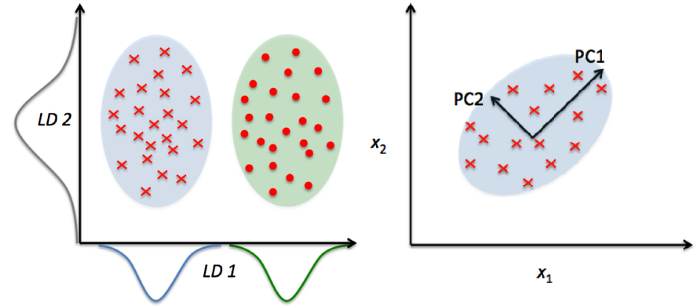
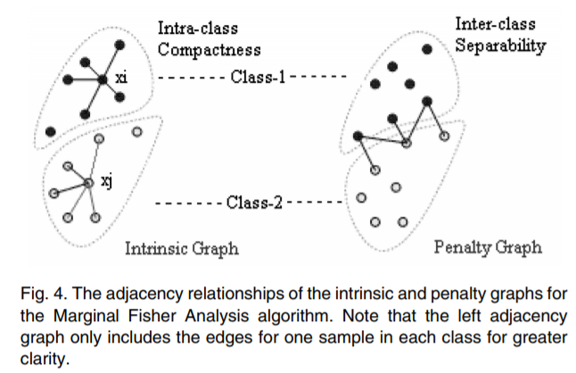

# Graph Embedding and Extensions: A General Framework for Dimensionality Reduction  

## Personal Info
ID: R08922A20
NAME: 洪筱慈

## Paper basic information

- Paper link: https://www.researchgate.net/publication/220181328_Graph_Embedding_and_Extensions_A_General_Framework_for_Dimensionality_Reduction  
- Conference/Journal: IEEE Transactions on Pattern Analysis and Machine Intelligence 29(1):40-51  
- Demo: None
- GitHub: None
- work field: `Dimension Reduction`, `Feature Engineering`  

## Key contribution  
提出一種新的降維方式 Marginal Fisher Analysis (MFA)， 能夠使 intra class 更加群聚， inter class 分得更開。

## Introduction 
### 什麼時候會用到降維？   
舉影像辨識為例，要判斷一張照片中是貓還是狗，我們其實不需要知道每一個 pixel 的值是多少，只要知道輪廓，就能夠判斷出來。真實的訓練資料通常是很高維度的資料，例如相片 raw 檔，說話音源，但是真實資料中往往包含許多重複不需要的 feature， 假如 feature 數量相較於 training data 的數量大很多，就可能導致 model overfitting，因此減少不必要 feature 的一種方式就是降維。  

  
*Fig.1: The Curse of Dimensionality: As the number of features increases, the model becomes more complex. The more the number of features, the more the chances of overfitting. [2]*

### 常見的降維方法 
1. 線性降維：PCA (Principal Component Analysis),Factor Analysis, LDA (Linear Discriminant Analysis)  

  
*Fig.2: PCA orients data along the direction of the component with maximum variance whereas LDA projects the data to signify the class separability [2]*

2. 非線性降維： ISOMAP、LLE、Laplacian Eigenmap, kernel trick 。  

### 傳統降維的缺陷

然而，這些傳統的降維方式，都是建立在 “各個群體的資料本身都是高斯分佈" 假設下做分群的，你可以從上面 Fig. 2 的 PCA 圖中看見。真實世界的資料，當然不會那麼完美符合高斯分佈，因此傳統的降維做法存在誤差和缺陷。這篇 paper 中提出的 FMA，就是為了解決這樣的問題。

### Marginal Fisher Analysis  
      

MFA 是一種基於 graph embedding framework 的方法, 其中包含： 
1. intrinsic graph: 評估同一類別 data 的緊密程度(compactness)  
2. penalty graph: 評估不同類別 data 之間的差異程度。  

Graph embedding，是用來將 graph 上的 node, edge 等等轉換到向量空間，但是仍然保存 graph 的架構和性質。（ graph 上的 node 是離散的，但是 deep learning 需要作用於連續的空間，因此 graph embedding 是將離散性質 mapping 到連續空間，才能納入 model 使用）   

### Experiments  
為了證明 MFA 的效用，作者將之做在 Face Recognition 上面，實驗顯示加了 MFA 可以提高 performance。    

## Reference
[1] [Why is Dimensionality Reduction so Important?](https://medium.com/@cxu24/why-dimensionality-reduction-is-important-dd60b5611543)  
[2] [A beginner’s guide to dimensionality reduction in Machine Learning](https://towardsdatascience.com/dimensionality-reduction-for-machine-learning-80a46c2ebb7e)  
[3] [機器學習: 降維(Dimension Reduction)- 線性區別分析( Linear Discriminant Analysis)](https://chih-sheng-huang821.medium.com/%E6%A9%9F%E5%99%A8%E5%AD%B8%E7%BF%92-%E9%99%8D%E7%B6%AD-dimension-reduction-%E7%B7%9A%E6%80%A7%E5%8D%80%E5%88%A5%E5%88%86%E6%9E%90-linear-discriminant-analysis-d4c40c4cf937)    
[4] [Graph Embedding and Extensions: A General Framework for Dimensionality Reduction](https://hackmd.io/@Ql-hvOksS5KKmIlqAPPrMA/paper_summary/https%3A%2F%2Fhackmd.io%2FtzOBPOFBTom8vAmPery23A%3Fview)  
[5] [Graph Embedding for Deep Learning](https://towardsdatascience.com/overview-of-deep-learning-on-graph-embeddings-4305c10ad4a4)

